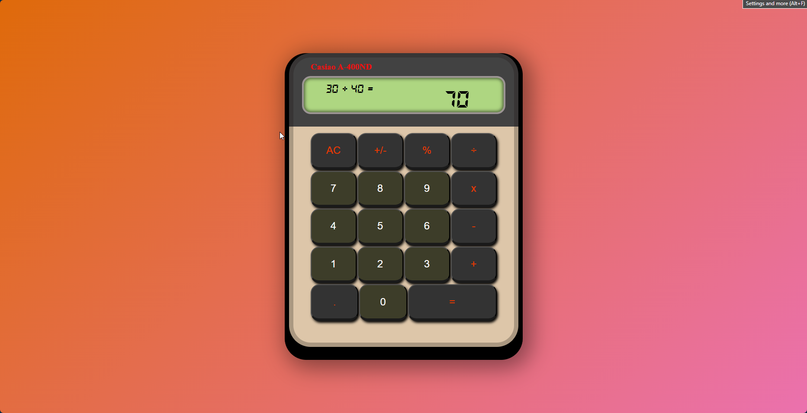

# 🚀 Calculator Project

Welcome to the **Calculator Project**! 🎉 This is not just a calculator—it's a sleek, responsive, and beginner-friendly tool that showcases the magic of **HTML**, **CSS**, and **JavaScript**. Whether you're crunching numbers or diving into web development, this project has something for everyone.

---

## ✨ Features

✅ **Basic Operations**: Add, subtract, multiply, divide—do it all!  
✅ **Instant Results**: See your calculations update in real time.  
✅ **Stylish UI**: Minimalist design with a modern flair.

---

## 🌟 Demo

Check out the live version here: [Calculator Demo](#) _(https://rukit24.github.io/calculator/)_

---

## 🛠️ Technologies Used

- **HTML5**: To structure the app beautifully.
- **CSS3**: For that sleek and responsive design.
- **JavaScript**: The brains behind the operations.

---

## 🚀 Getting Started

### Prerequisites

All you need is a web browser! No complex setup required. 🌐
